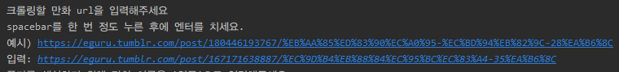
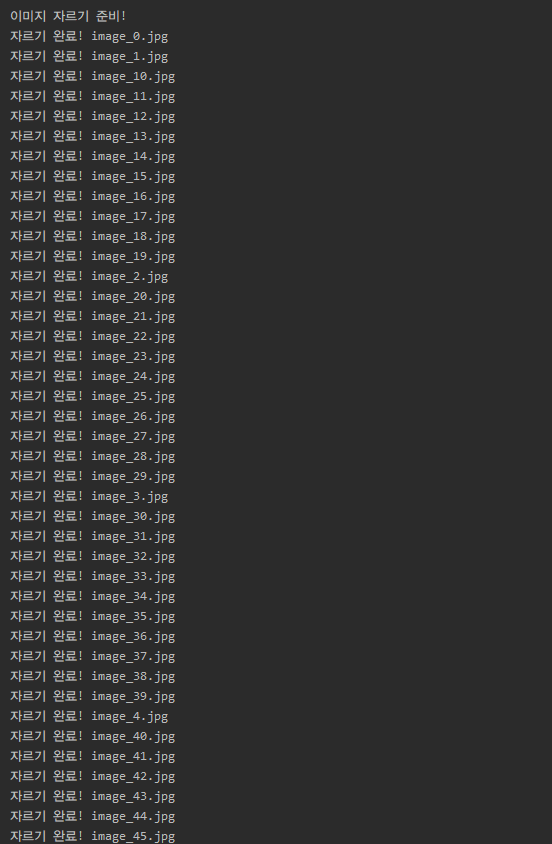

## :pushpin: 프로그램 설명 

만화사이트 [이구루](https://eguru.tumblr.com/)에서 만화 이미지를 크롤링하여 이미지를 잘라 크기를 재정의해줍니다.

#### 프로그램 주요 기능

* 만화 이미지 크롤링
* 만화 이미지 자르기

* 만화 이미지 크기 조정

#### 프로그램 실행 후 생성 폴더

* **images**: 웹사이트에 게재되어 있는 이미지 1개

* **dividedImages:** 하나의 이미지에 만화 2페이지를 2쪽으로 나눈 이미지

* **resizedImages**: 특정 크기에 맞춰 일정 크기 만든 이미지

## :high_brightness: 사용 언어 및 라이브러리

#### 사용 언어

* python

#### 사용 라이브러리

* requests
* beautifulsoup
* PIL
* multiprocessing
* cv2

### 프로그램 사용 시나리오

1. **만화 url 입력**

2. **만화 이미지 저장할 폴더 이름 입력**

실행 결과

1.  images 폴더에 모든 이미지 다운로드

   

2. dividedImages 폴더에 이미지를 특정 크기로 잘라 저장

3. 자른 이미지 특정 크기로 재조정하여 폴더 resizedImage에 저장  

